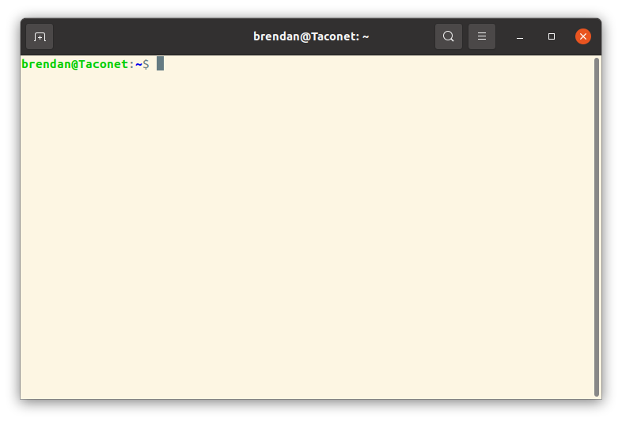
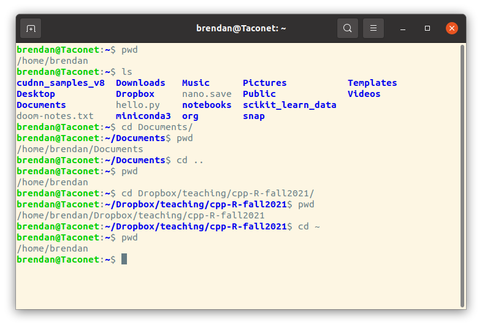

# Table of Contents

1.  [What is the terminal?](#orgac449ca)
2.  [The parts of the shell (terminal)](#org6ec3066)
3.  [Navigating the file system](#org0614712)
4.  [Making, deleting, moving, copying, renaming files and directories](#orgb3a9623)
5.  [Some useful commands](#org75fb94a)

# What is the terminal?

The terminal (or &ldquo;shell&rdquo;, or &ldquo;command line shell&rdquo;) is a text based program that allows you to interact with your computer (before graphical user interfaces, this
was the main way to interact with a computer).

To use the terminal on a Mac, search for &ldquo;terminal.app&rdquo; or find it in the utilities folder.
For Windows, you can use *PowerShell*, which is the terminal program used by VSCode.
Linux distributions should come with a terminal app as well.

You can use the terminal to navigate your computer&rsquo;s file system, and move/create/delete files and directories (i.e. &ldquo;folders&rdquo;).
The terminal does a lot more than this though, you can also use it to install and configure software, run programs, manipulate and search text, manage and automate processes on your computer, and much more.
Your computer&rsquo;s graphical interface tends to hide things from you, but the terminal gives you &ldquo;behind the scenes&rdquo; access. (Including the ability to delete a lot of important files, so be cautious!)

The following basic commands are standard unix/linux commands, but they work in the Mac terminal and PowerShell (check the last section of this Wikipedia page for unix shell vs. PowerShell commands <https://en.wikipedia.org/wiki/PowerShell>).
Also a fun note: on Unix/linux/Mac most of these commands are written in C! Unix was originally written in C, and the two are closely linked.

# The parts of the shell (terminal)

The terminal will open in a new window. You will see a *prompt*: in my case, it is `brendan@Taconet:~$`.

The prompt displays my username, the name of my computer (Taconet), a colon, the current directory `~`, and ends with `$` (yours might end with `>`).

To use the terminal, you type commands (possibly with arguments), which appear after the prompt, then hit enter. The command may return some output. When the command finishes running, the prompt returns.

# Navigating the file system

-   In linux (and the Mac command line), folders are called *directories*.
    -   the location of a directory is specified by a *path*, which is a list of directories separated by backslashes
    -   for instance, my &ldquo;home&rdquo; directory is `/home/brendan`, which is abbreviated by `~`.
    -   the highest level directory is simply denoted `/`.
-   `pwd` prints current (working) directory
-   `ls` lists stuff in current directory
    -   `ls -a` lists &ldquo;hidden files&rdquo; as well (those begin with a `.`)
    -   if you do `ls -a`, you&rsquo;ll see `.` and `..`, which are the names for the current directory and the parent directory.
-   `cd` change directory
    -   `cd foo` moves into directory &ldquo;foo&rdquo; (replace &ldquo;foo&rdquo; with whatever directory you want to enter)
    -   `cd ..` moves to the parent directory
    -   `cd ~` moves to your home directory
    -   `cd some/file/path/to/a/directory` would take you through a directory &ldquo;some&rdquo;, which is in the current directory, then through a directory &ldquo;file&rdquo;, which is in the &ldquo;some&rdquo; directory, and so on.
    -   `cd /Users/your_username/Documents` will take you from your current location to your Documents folder
        -   notice the &ldquo;path&rdquo; `/Users/your_username/Documents` started with a `/`. This is called an *absolute path*. If you do not include the leading `/`, like the previous example, then the terminal will assume that directories you want to navigate to are contained in the current directory.

Here is an example:

-   I start in my home directory; `pwd` shows the path is `/home/brendan`
-   I use `ls` to list the contents of the directory (these are the files you&rsquo;ll usually see in the GUI file explorer).
-   I use `cd Documents/` to move to the documents folder; `pwd` shows the path of the Documents folder.
-   I use `cd ..` to go back to the previous folder (my home directory).
-   Now I use `cd Dropbox/teaching/cpp-R-fall2021/` to go into my directory for this course. Again, I show the path with `pwd` (you don&rsquo;t need to do this every time, I&rsquo;m just doing it for illustration).
-   Finally, I move directly to the home directory by typing `cd ~`.

Tips:

-   use &ldquo;tab&rdquo; to autocomplete
-   use the up and down arrows to re-use previous
-   directory names in Windows use forward slash \\ instead of backslash /, but PowerShell seems to accept either.

# Making, deleting, moving, copying, renaming files and directories

-   `mkdir` makes a directory, use like `mkdir my_new_directory`.
    -   Note: avoid spaces in your file and directory names, use underscores or dashes instead (this is because the terminal interprets a space as separating arguments for the commands you enter, to enter a space you need to escape it with a &rsquo;\\&rsquo;).
-   `rmdir` removes a directory; this won&rsquo;t work if the directory is not empty, so you need to remove the files from within the directory first
-   there are many ways to create files in Unix, but if you just want to create an empty file, you can type `touch filename`, for instance `touch notes.txt` will create a file called &ldquo;notes.txt&rdquo;. To edit this file, you need a text editor, which we&rsquo;ll talk about later.
-   `rm` removes a file.
    -   `rm notes.txt` will delete the file &ldquo;notes.txt&rdquo;
    -   if you want to remove a file that is not in the current directory, you can move to the directory containing the file, or include the path, e.g. `rm ~/Downloads/rubbish.pdf` will remove the file &ldquo;rubbish.pdf&rdquo; from your downloads file.
    -   If you want to remove a directory and all of its contents, type `rm -r some_directory`. You can&rsquo;t undo this, so be very certain you want to delete these files. (These files *won&rsquo;t* go to &ldquo;Trash&rdquo;.)
-   `mv` moves a file
    -   Suppose I have a directory with &ldquo;notes1.txt&rdquo; and &ldquo;notes2.txt&rdquo;. I create a notes directory (folder) `mkdir notes`. Then I can move the notes files into &ldquo;notes&rdquo; using `mv notes1.txt notes` and then `mv notes2.txt notes`. To move both files at once, I could use `mv notes1.txt notes2.txt notes`.
    -   `mv` can also rename files, for instance `mv notes1.txt notes3.txt` renames &ldquo;notes1.txt&rdquo; to &ldquo;notes3.txt&rdquo;.
    -   To move files from the current directory to the parent directory use `mv file ..` (recall `..` is the name of the parent directory).
    -   So if I type `cd notes` to move the notes directory and type `mv notes2.txt ..`, it will move notes2.txt back to its original location, outside the notes directory.
    -   Note: use the command `whoami` to find out your user name.

# Some useful commands

-   Interrupt a program: ctrl-c
    -   (nicely) asks a program to terminate
    -   use this to get your prompt back
    -   doesn&rsquo;t work for all command line programs
-   `chmod` changes permissions (&ldquo;mode&rdquo;) of files
    -   you can add or remove read, write, or execute permission for a user, group, or all.
    -   linux is related to unix, which was typically used at large universities and companies, where many users could log in to a computer at the same time. Users could be organized into groups with similar permissions. Of course, you might not want to give the entire organization or your working group permission to read or change your personal files.
    -   To give yourself
-   `sudo` means &ldquo;superuser do&rdquo;, which allows you to do administrative tasks by acting as the &ldquo;superuser&rdquo;
    -   e.g. you might need to do `sudo chmod ...` to change permissions for some files
    -   the *superuser* is a special account used for system administration; this account is probably called &ldquo;root&rdquo; or &ldquo;admin&rdquo;
    -   standard users do not have the same permissions as the superuser&#x2014;this is to stop you from accidentally damaging your computer!
        -   be very careful about using `sudo` to delete things!
        -   you often need to use `sudo` to give yourself write permissions for certain files. It&rsquo;s a good idea to make a copy of the original protected file before modifying it. You may also have to use `sudo` to edit the file, e.g. `sudo nano /filename/`.
        -   It is also common to use `sudo` to install packages from the command line. This is similar to your computer asking for a password to install things from the App Store.
-   `man` shows the manual for a command.
    -   e.g. `man ls` will tell you about the command `ls`
    -   man pages have *a lot* of detail.
    -   There is a friendly program called `tldr` that you can install. Google &ldquo;tldr bash&rdquo;
-   `cat` prints the contents of a file to the terminal (use like: &ldquo;cat *somefile*&rdquo;)
-   `nano` is a lightweight text editor
    -   use like: `nano /filename/` to edit an existing file
    -   lists the most common commands on the screen, e.g. `^X` means ctrl-x

