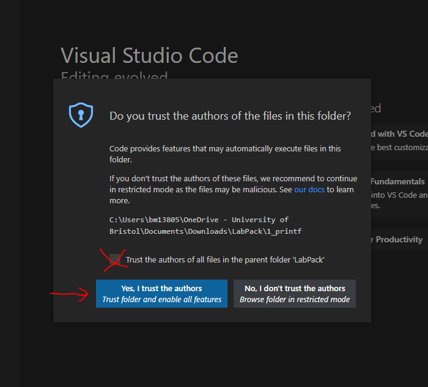

# Table of Contents

- [Table of Contents](#table-of-contents)
- [Download the labpack](#download-the-labpack)
- [Extract the zip file using 7zip](#extract-the-zip-file-using-7zip)
    - [7zip is a popular decompression tool and has been preinstalled on all lab computers. However, if you have not installed 7zip on your computer, you can download and install it here: https://www.7-zip.org/. You can use windows to decompress the labpack, but it will be slow.](#7zip-is-a-popular-decompression-tool-and-has-been-preinstalled-on-all-lab-computers-however-if-you-have-not-installed-7zip-on-your-computer-you-can-download-and-install-it-here-httpswww7-ziporg-you-can-use-windows-to-decompress-the-labpack-but-it-will-be-slow)
- [Using the labpack](#using-the-labpack)
- [Compiling “Hello, world!”](#compiling-hello-world)
- [Compiling from the terminal](#compiling-from-the-terminal)

# Download the labpack

Click [here](https://uob-my.sharepoint.com/:u:/g/personal/sl9885_bristol_ac_uk/EUHEsCCFDeFMlX_1UAocAh4By7JVjJoBHhcFMVyEXwghxA) to find the labpack on sharepoint; you may have to enter your ID and password.

Click &ldquo;download the entire zip file&rdquo;.

Save the file.

Wait until the download is complete before trying to open it.
If it says &ldquo;Download Failed&rdquo;, click the circular arrow to restart the download.

Open the file in the file explorer:

# Extract the zip file using 7zip

### 7zip is a popular decompression tool and has been preinstalled on all lab computers. However, if you have not installed 7zip on your computer, you can download and install it here: https://www.7-zip.org/. You can use windows to decompress the labpack, but it will be slow. 

----- 
Right click on the labpack and unzip it using 7zip (choose &ldquo;Extract here&rdquo;):

It will take about 5 minutes to unzip.

# Using the labpack

Open the labpack:

Double-click on the &ldquo;lab1&rdquo; .bat file to launch VSCode:

(If it says you can&rsquo;t open it, click &ldquo;more info&rdquo;, then say &ldquo;open anyway&rdquo;.)

Accept the trust settings:

# Compiling &ldquo;Hello, world!&rdquo;

Double click on &ldquo;main.c&rdquo; to see the code for &ldquo;Hello, world!&rdquo;.

From the top menu, choose &ldquo;Start Debugging&rdquo; from the &ldquo;Run&rdquo; category:

Choose &ldquo;C++ (GDB/LLDB)&rdquo;:

Choose &ldquo;gcc&rdquo;:

After a while, you should see a menu on the bottom half of VSCode.
Select &ldquo;TERMINAL&rdquo; to see the output of the program:

# Compiling from the terminal

Type &ldquo;ls&rdquo; (letter l, not number 1) in the terminal and hit &ldquo;enter&rdquo;:

This shows files in the current directory (folder): main.c is the hello world program we compiled, and main.exe is the program that the compiler output.

To compile from the command line, type `gcc main.c -o main.exe` in the terminal and hit enter.
To run the program, type `./main.exe`.

